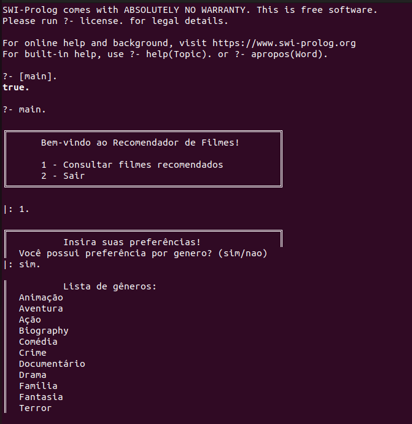
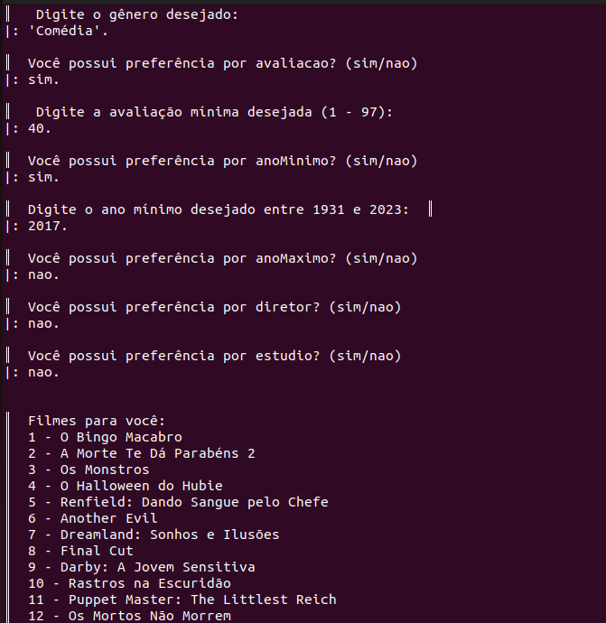
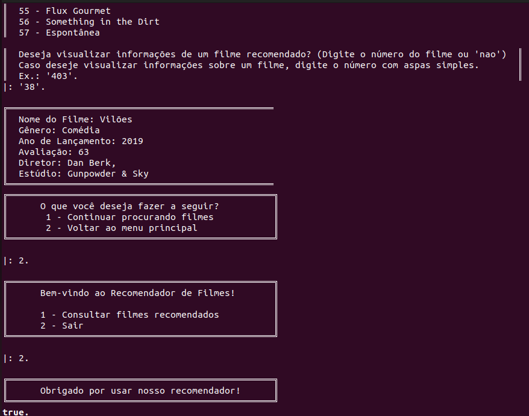

# Halloween Critic Prolog

**Disciplina**: FGA0210 - PARADIGMAS DE PROGRAMAÇÃO - T01 <br>
**Nro do Grupo (de acordo com a Planilha de Divisão dos Grupos)**: 04<br>
**Paradigma**: Lógico <br>

## Alunos
|Matrícula | Aluno |
| -- | -- |
| 17/0085023 |  Carla Rocha Cangussú |
| 20/0028472 |  Vinícius Assumpcao de Araújo |
| 18/0063162 |  Daniel Primo de Melo |
| 20/2029012 |  Josué Teixeira Santana |
| 20/0020650 |  João Pedro de Camargo Vaz |
| 18/0124099 |  Juliana Pereira Valle Gonçalves |
| 20/0018248 |  Gabriel Roger Amorim da Cruz |
| 19/0015721 |  Júlio César Martins França |

## Sobre 
Este é um projeto de implementação de um sistema de recomendação de filmes com a temática de Halloween em prolog. Foi baseado no metacritic.   

### Funcionalidades Principais
1. Base de Dados e Entrada de Informações:
    - Estrutura para armazenar informações dos filmes (título, gênero, ano, avaliação, diretor e estúdio).
    - Base de conhecimento com mais de 1300 filmes.
    - Predicados para coletar preferências do usuário (gêneros, estúdios, etc).
  
2. Regras de Recomendação:
    - Regras para recomendar filmes baseados em critérios do usuário (gênero, ano, avaliação, etc).

3. Interação com o Usuário:
    - Interface básica de interação.
    - Predicados para receber consultas e preferências do usuário.
    - Método para exibir recomendações ao usuário.

4. Personalização e Detalhes dos Filmes:
    - Mostrar informações detalhadas dos filmes (gênero, ano de lançamento, nota de avaliação, diretor e estúdio).

## Screenshots







## Instalação 
**Linguagem**: Prolog<br>
**Tecnologias**: SWI Prolog<br>

Para instalação do SWI Prolog, é necessário realizar os seguintes comandos:

```
sudo apt-add-repository ppa:swi-prolog/stable
sudo apt-get update
sudo apt-get install swi-prolog
```

## Uso 

1. Clonar o repositório

```
git clone https://github.com/UnBParadigmas2023-2/2023.2_G4_Logico.git
```

2. Entrar na pasta app

```
cd 2023.2_G4_Logico/app
```

3. Entrar no SWI Prolog

```
swipl
```

4. Carregar o programa

```
[main].
```

5. Executar o predicado main

```
main.
```

Após a execução destes comandos, você será capaz de visualizar a aplicação em execução no terminal. 

Obs: Para cada entrada no terminal, é necessário colocar . no final. Para digitar uma string, é necessário colocar entre aspas simples, além do . no final!

## Vídeo
 [LINK PARA O VÍDEO DE APRESENTAÇÃO](https://youtu.be/MCJYWCsv1XE)
## Participações

|Nome do Membro | Contribuição | Significância da Contribuição para o Projeto (Excelente/Boa/Regular/Ruim/Nula) |
| -- | -- | -- |
| Vinicius Assumpção  |  Criação do esqueleto base que foi utilizado para a implementação do projeto,e revisões posteriores  | Excelente |
| João Pedro de Camargo Vaz  |  Criação do esqueleto base que foi utilizado para a implementação do projeto,e revisões posteriores | Excelente |
| Gabriel Roger Amorim da Cruz | Criação do esqueleto base que foi utilizado para a implementação do projeto, colaboração na listagem de preferências disponíveis e revisões posteriores | Excelente | 
| Josué Teixeira Santana | Criação da feature das informações detalhadas dos filmes listados | Excelente |
| Carla Rocha Cangussú | Criação da Interface via terminal e tentativa de criar interface gráfica pelo módulo pce| Excelente |
| Juliana Pereira Valle Gonçalves | Criação de script de extração de filmes para popular a base de dados | Excelente |
| Daniel Primo de Melo  | Criação da interface via terminal. Tentativa de criação da interface gráfica | Excelente |
| Júlio César Martins frança | Implementação da parte de listagem das opções para o usuário e na validação dos dados de entrada | Excelente |

## Outros 

Desenvolver um sistema de recomendações de filmes de Halloween em Prolog foi uma jornada repleta de descobertas e aprendizados. A natureza declarativa da linguagem realçou a essência de pensar em termos de "o quê" ao invés de "como", o que estimulou uma abordagem mais lógica e introspectiva para o desenvolvimento. Além disso, o mergulho em sua biblioteca padrão e a manipulação de bases de dados em Prolog foram cruciais para o sucesso do projeto. O constante desafio de definir regras claras e eficientes para as recomendações demonstrou a relevância de uma programação lógica bem fundamentada. Em resumo, esse projeto não apenas aprofundou nosso conhecimento em Prolog, mas também fortaleceu nossa capacidade analítica, ilustrando a importância de pensar logicamente em cenários de decisão e recomendação.

## Fontes
- https://www.metacritic.com
